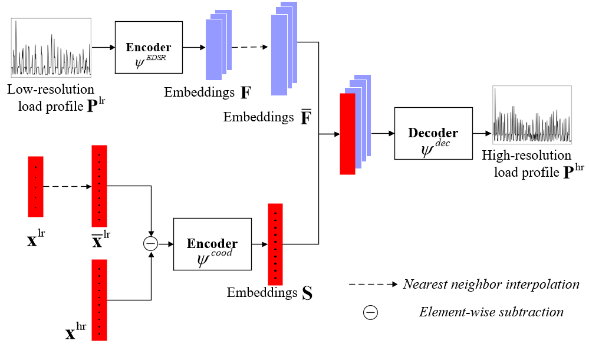
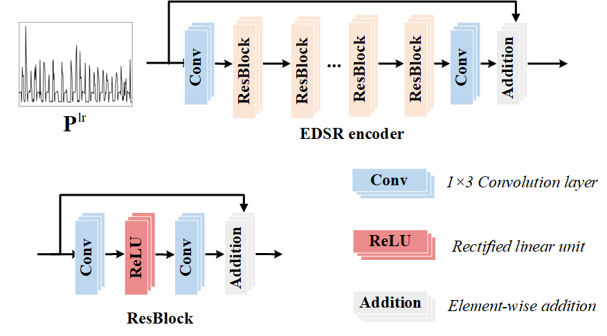

# Load-Reconstruction-with-Arbitrary-Super-Resolutions-PyTorch
This repository is an official PyTorch implementation of the manuscript **"Load Reconstruction with Arbitrary Super Resolutions"**. The manuscript is currently under the 1st revision from the IEEE Power and Energy Society (IEEE PES).

* The main component of the proposed method is uploaded to the site. Any people of interest can freely access the codes, replicate the experiments, and verify the results.

* This repository is currently under construction. We will continue to update new codes in the repository.

## Dependencies
* Python 3.6
* PyTorch >= 1.12.0
* Numpy = 1.19.2
* Pandas = 1.3.5

## Method

